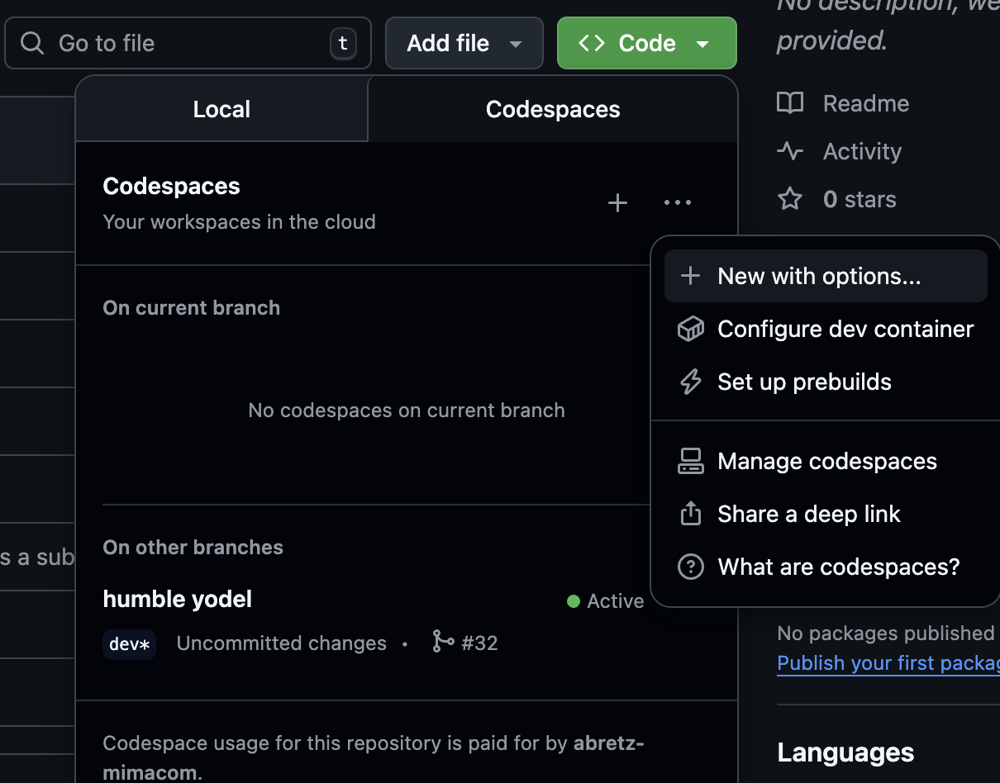
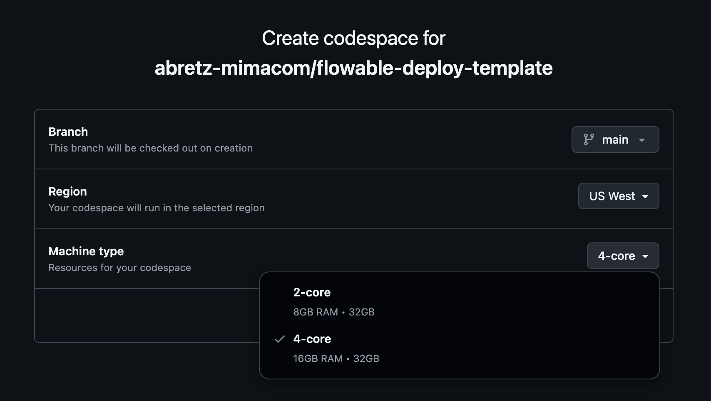

# flowable-deploy-template

This repository is #2 of 3 that is meant to serve as a "Best Practice Example" when it comes to Flowable DevOps. Below is the architecture and prescribed Git Branching stratgey for the 3 repositories:


# Introduction

Zooming into the second portion of the diagram, we can focus on the purpuse of this repository: Flowable deployments via Helm.


## Getting started
Thise Best Practices guide on DevOps with Flowable delivered as working code to give functional exmaples to explain these concepts more thoroughly. The easiest way to get started is to create your own project off of this project template, then open the project inside GitHub Codespaces - they are free with a GitHub account and they contain all the  software and configurations to get this example running in as few steps as possible.

### Create Env
1) Create your own repo using this repo as a template: [click here] (https://github.com/new?template_name=flowable-deploy-template&template_owner=abretz-mimacom)

2) Next, setup a personal access token (PAT) by navigating to Profile->Settings->Developer Settings->Personal access tokens-> Tokens(classic) - or [click here](https://github.com/settings/tokens). Then create a PAT with the following scopes - NOTE: make sure to copy the token value after creation and paste somewhere for later:


3) After copying the token value from the newly created PAT (you can create a new one if you've moved on from the post-create screen and didn't copy), navigate back to your new project repo (ex, https://github.com/<your-github-org>/flowable-deploy-template), then go to Settings->Secrets and Variables->Codespaces:
```
ARC_TOKEN=<REPLACE_WITH_YOUR_COPIED_PAT>
FLOWABLE_LICENSE_KEY=<REPLACE_WITH_RAW_TEXT_VALUE_OF_FLOWABLE_LICENSE>
FLOWABLE_REPO_USER=<REPLACE_WITH_EMAIL_ASSOCIATED_WITH_FLOWABLE_ARTIFACTORY>
FLOWABLE_REPO_PASSWORD=<REPLACE_WITH_PASSWORD_ASSOCIATED_WITH_FLOWABLE_ARTIFACTORY>
```
We will need these values inside the Codespace environment to spin up a QA/PROD Flowable environemnt that includes a Github action runner that will listen for [actions](.github/workflows/deploy-dev-qa.yml) (github ci jobs), which will result in a new Flowable deployment based on conditions set in the actions.

4) Next, navigate to Settings->Secrets and Variables->Actions and create the following Repository Secrets (not Environment secrets):
```
FLOWABLE_LICENSE_KEY=<REPLACE_WITH_RAW_TEXT_VALUE_OF_FLOWABLE_LICENSE>
FLOWABLE_REPO_USER=<REPLACE_WITH_EMAIL_ASSOCIATED_WITH_FLOWABLE_ARTIFACTORY>
FLOWABLE_REPO_PASSWORD=<REPLACE_WITH_PASSWORD_ASSOCIATED_WITH_FLOWABLE_ARTIFACTORY>
```

These will allow the action runner to have the necessary secrets for a Flowable deployments based on repo actions, in addition to our Codespace env where we are initially building the env.

5) #### Create Codespace
Return to the home page of your `flowable-deploy-template` repo (ex, https://github.com/<your-github-org>/flowable-deployment-template) and create a new Codespace for your new project by clicking the green "Code" dropdown button and selecting a Codespaces (instead of Local) and clicking the elipsis select "New with options":


Then select 4-core for Machine type:


Create Codespace

6) A VSCode Web environemnt with this project as the root workspace. You'll need to open the terminal, which can be done by clicking the "Warnings" icon on the very bottom ribbon of the page: 


Then clicking "TERMINAL on the pane that is brought up:


Once the terminal is open, execute:
    #### Install brew (to install kind&k9s)
        `/bin/bash -c "$(curl -fsSL https://raw.githubusercontent.com/Homebrew/install/HEAD/install.sh)"`
        `echo 'eval "$(/home/linuxbrew/.linuxbrew/bin/brew shellenv)"' >> ~/.bashrc`
        `eval "$(/home/linuxbrew/.linuxbrew/bin/brew shellenv)`

    #### Install kind and k9s
        `brew install kind derailed/k9s/k9s`

    ##### Run the create-env script
        `./create-env.sh --all`

        This creates 2 Kind (k8s) clusters named "qa", and "prod". Inside "qa", there is a flowable deployment in both the "dev" and "test" namespaces. Inside "prod" there is a flowable deployment in only the "stg" namespaces. 
        
        For simplicity and resource contraints, "prod" namespace/deployment will be ignored in this example. However, the eventual "prod" deployment should always be identical to the "stg" deployment, thus allowing us to ignore it.

7) #### k9s observe:
     Get coffee and wait. It will take about 5 minutes for all the deployments to fully complete. After the script completes, it will bring up the terminal utility known as [k9s](https://k9scli.io/) with the following command:
     `k9s -c --crumbless` 

    This tells k9s to ignore our currently set kubeconfig context and starts you at a cluster selection menu. You should see something like this, asking for a cluster selection:
     
     Use the up/down arrow keys to select a cluster and key Enter to enter the "pods" menu, which shows all pods in all namespaces and their states. Select the "qa" cluster because we'll push changes there first.

     Key
    

    Although there are too many feature of k9s to cover in detail here, we will be using it to as an introduction to the tool and to do some basic observations of the pod state in our cluster. 

8) ## k9s verify: 
    Key the number corresponding with the "dev" namespace, then the number for "test", then the number for "all"
        ![alt text]

        Each "pod" in this view will show varying STATUS and READY states on initial deploy. Wait for everything to have a STATUS=Running

        You now have a running Flowable deployment inside your Codespaces Kind cluster!
    
    Next, we need to verify the action runner is also running and in a healthy state. From the k9s terminal session, enter `0`, or the number associated with "all" in the k9s namespace selector:
        
    
    Verify ythere is a pod named repo-runner-* in the `ci` NAMESPACE. You can use arrow up/down keys, as well as mouse scroll on any menu:
        
    
    Hit Enter key on the `repo-runner` pod; this. Verify the container logs end with something resembling the following:
        ```
            │ √ Connected to GitHub                                                                                                                  │
            │                                                                                                                       │
            │ Current runner version: '2.328.0'
            │
            │ 2025-09-16 15:22:14Z: Listening for Jobs   
        ```
    Key Esc to return to prior/parent menu.

    You now have a complete cluster that will deploy changes to the cluster env on remote repo changes. How neat!

9) Exit k9s (anytime) with `ctrl+c`

### Access dev deployment
If you've started with the [Create Env](#create-env) steps, you might be wondering how to access the web UI's for the Flowable platform, and you would be correct in doing so. The easy button for us in this case will be to port-forward the service ports for the pods we care about (Work, Control, Design). Fortunately, I have a script for that.

From the terminal:
```
kubectl config use-context kind-qa
bash -c "scripts/port-forward-flowable-ui.sh dev flowable"
```

This will forward web traffic from the container port to the local machine (GitHub Codespaces host in this case). In the same task pane as TERMINAL, go to PORTS and there should be new entries for ports:
    - 8080: Flowable Work
    - 8081: Flowable Design
    - 8082: Flowable Control

For each Flowable container port (Work:8080, Design:8081, Control:8082), you will need to change the visibility to "public" by right clicking the port entry and changing port visibility to Public
    

You can now access these ports over the open web by clicking the globe icon Forwarded Address url:
    

You will receive the following warning page when first accessing these urls:
    

    This is Github warning you to not trust any of these URL's to enter private data. You may click Continue.

You should now be greeted with a Flowable Login page:
    

    Use the `admin:test` username:password for the dev cluster. Soon, we will standup our prod cluster with OAuth2.

Return to the VSCode env and go to TERMINAL.

Key `ctrl+c` to exit scripts/port-forward-flowable-ui.sh (if still running). Those services will now be unavailable on the web. Re-run the script any time to access the web interfaces of the Flowable deployment.

